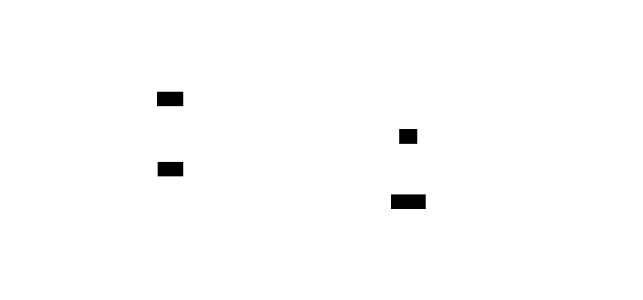

# Welcome to my portfolio 🎉
The goals of this project are to show case my work and skills to potential recruiters.
## Build with 🛠
- [Eleventy](https://www.11ty.dev/)
- [Nunjucks](https://mozilla.github.io/nunjucks/)

### Goals 🎯

### Ideas of improvments 📝
- [x] Multilingual website
- [ ] Add a summary to the project pages
- [ ] Include images/gifs/videos to projects. 
## Architecture



## Getting start🚀
### Prerequisites
- [Git](https://git-scm.com)
- [Node](https://nodejs.org/en)

### Installation 🔧
```
git clone https://github.com/LionelPinheiroDuarte/portfolio.git
cd portfolio
npm install
npx @11ty/eleventy --serve
```

For those who don't to download thing, you can use docker. 🐳
```
git clone https://github.com/LionelPinheiroDuarte/portfolio.git
cd portfolio
docker build -t lionelpinheiroduarte-portfolio .
docker run -p 8080:8080 lionelpinheiroduarte-portfolio
```
## Acknowledgement 🧑‍🤝‍🧑
- [Helped me with the internalization feature](https://www.lenesaile.com/en/blog/internationalization-with-eleventy-20-and-netlify/)
